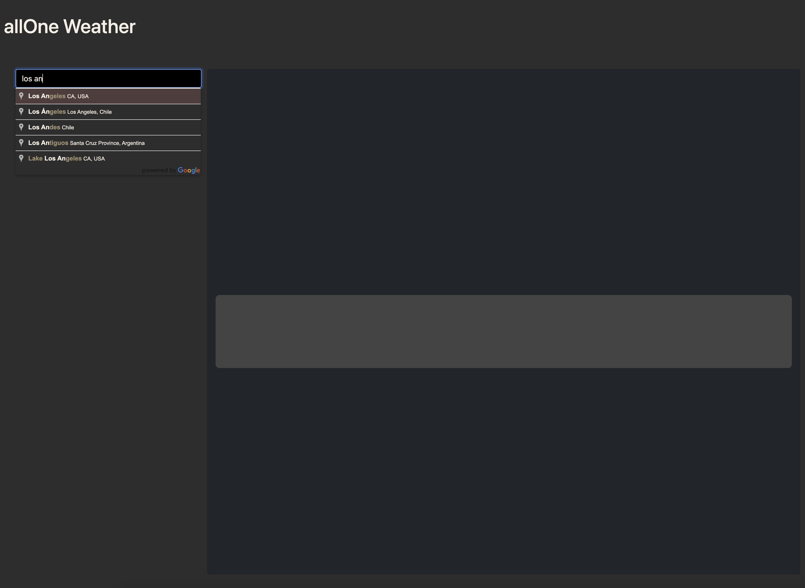
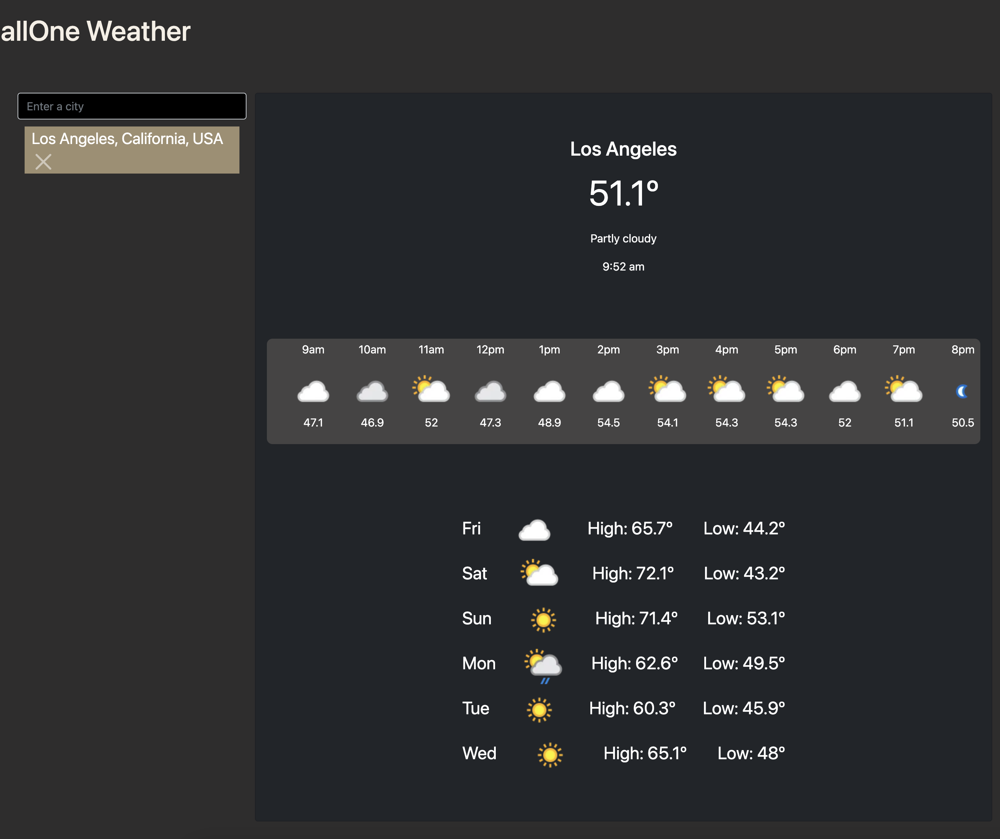

# weatherApp

https://autohome.github.io/weatherApp/

## Description

This spectacular weather app was made to showcase Joshua Dadbin's skills in communicating with both server side and third party APIs via javascript. In true Josh fashion, he also paid great attention to detail on the CSS (with a little help from bootstrap) and HTML to create an easy and enjoyable UI which is visually pleasing.

## Table of Contents 

- [Installation](#installation)
- [Usage](#usage)
- [Credits](#credits)
- [License](#license)

## Installation

n/a

## Usage

You can visit the site at https://autohome.github.io/weatherApp/

To use thise site:

Navigate on the homepage to the black search box that says 'Enter a city'. Please enter the city you would like to view the weather details

The site will be notified when you start typing and google autocomplete will initiate to help you find the ciity you are looking for. Nice! Once you see the city you desire, please click on its name.

Once selected, the weather for your chosen city will appear in detail. You will also notice a past history list under the search bar. This will make it easier for you to see your frequented cities next time you log on! If you do not want a city in your past history, just click on the X in the box and Voila!

## Credits

Many thanks to the staff and students of the 2023 Q2 Full Stack Coding Bootcamp.

[Google maps place autocomplete API documentation](https://developers.google.com/maps/documentation/javascript/place-autocomplete)

[Weather API Docs](https://www.weatherapi.com/docs/)

## License

MIT
